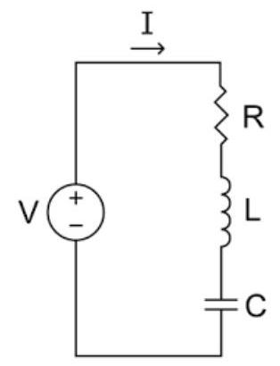

## Page 1

# Exercice 1 : Étude temporelle d'un circuit RLC série 

## $\checkmark$ Objectifs

Dans cet exercice, nous montrons comment modéliser et simuler dans MATLAB/SIMULINK un circuit contenant une résistance, une inductance et un condensateur connecté en séries.

## $\checkmark$ Énoncé de l'exercice

On considère un circuit RLC série composé :

- D'une résistance R,
- D'une inductance L,
- D'un condensateur C,
- Et d'une source de tension $\mathrm{V}(\mathrm{t})$.

La loi des mailles donne l'équation :

$$
V(t)=R \cdot i(t)+L \cdot \frac{d i(t)}{d t}+\frac{1}{C} \int i(t) d t
$$

On souhaite modéliser ce système dans Simulink, simuler la réponse i(t), et analyser l'effet des variations de R, L et C .

## $\checkmark$ Travail demandé

## 1. Modélisation du circuit

- Utiliser les blocs suivants dans Simulink :
- Step (source),
- Gain, Sum, Integrator,
- Scope (visualisation de i(t)).
- Implémenter l'équation en forme résolue :

$$
\frac{d i(t)}{d t}=\frac{1}{L}\left[V(t)-R \cdot i(t)-\frac{1}{C} \int i(t) d t\right]
$$

## 2. Simulation

- Choisir les paramètres de base :

$$
\text { o } \mathrm{R}=10 \Omega, \mathrm{~L}=100 \mathrm{mH}, \mathrm{C}=1 \mu \mathrm{~F} \text {. }
$$

- Simuler pendant 0.01 s
- Observer la courbe du courant $\mathrm{i}(\mathrm{t})$

## Page 2

# 3. Étude paramétrique 

- Étudier l'effet de :
- Une résistance faible $(\mathrm{R}=1)$
- Une résistance élevée $(\mathrm{R}=100)$
- Une inductance faible $(\mathrm{L}=10 \mathrm{mH})$
- Un condensateur plus grand $(\mathrm{C}=10 \mu \mathrm{~F})$
- Comparer les formes d'onde et commenter (amortissement, oscillations, régime permanent).